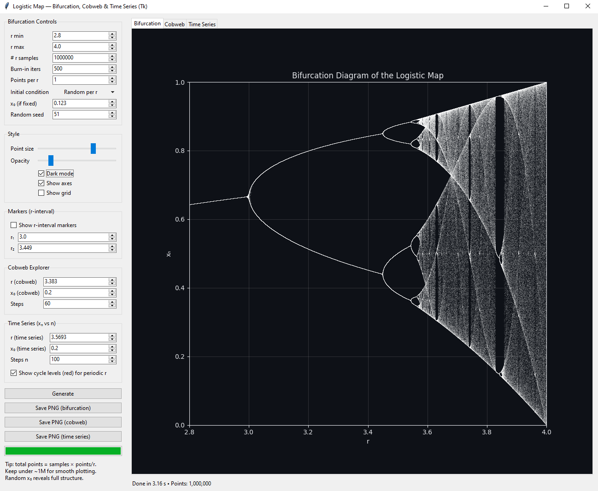
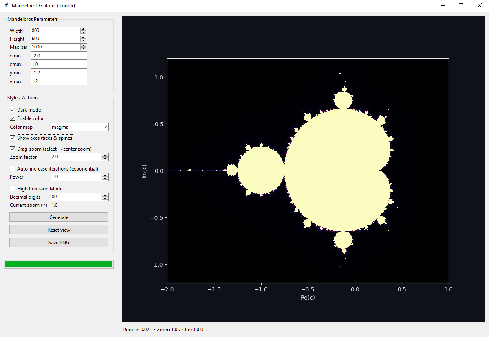

# Mandelbrot Geometry and Stability in Population Growth Models

This repository contains the code and research materials for my IB Mathematics HL Extended Essay.  
The project investigates the relationship between **period-n bulbs of the Mandelbrot set** and the **stability regions in the bifurcation diagram of the logistic map**.

---

## Research Question

**How do the period-n bulbs of the Mandelbrot set correspond to stability regions in the bifurcation diagram of the logistic map?**

---

## Background

### Mandelbrot Set

The Mandelbrot set is defined by the recursive relation:

$$
z_{n+1} = z_n^2 + c, \quad z_0 = 0, \quad c \in \mathbb{C}
$$

A complex number $c$ belongs to the Mandelbrot set if the sequence $\{z_n\}$ remains bounded as $n \to \infty$.  
Each **bulb** of the Mandelbrot set corresponds to parameter regions where the iteration settles into a cycle of given period.

### Logistic Map

The logistic map models population growth and is given by:

$$
x_{n+1} = r x_n (1 - x_n), \quad x_0 \in (0,1), \quad r \in (0,4]
$$

where:
- $r$ = growth rate parameter  
- $x_n$ = normalized population at time step $n$

The bifurcation diagram of the logistic map shows **stability windows** — intervals of $r$ where the system converges to a cycle of fixed period.

---

## Methodology

### Hypotheses
- **Null hypothesis**: There is no systematic correspondence between the period-n bulbs of the Mandelbrot set and the stability windows of the logistic map; any resemblance is accidental.  
- **Research hypothesis**: The period-n bulbs of the Mandelbrot set correspond directly to the period-n stability windows of the logistic map.

---

### Analytical Approach
A conjugacy is constructed between the two systems:

- Define the transformation  

$$
\Phi_r(x) = \frac{r}{2}(1-2x), \quad \psi(r) = \frac{r(2-r)}{4}.
$$

- Then  

$$
\Phi_r \circ f_r = P_{\psi(r)} \circ \Phi_r,
$$  

where  

$$
f_r(x) = r x(1-x), \quad P_c(z) = z^2 + c.
$$


**Consequences:**
1. Periods correspond: a cycle of period $k$ in $f_r$ maps to a period $k$ cycle in $P_{\psi(r)}$.  
2. Multipliers are preserved, ensuring stability equivalence.  
3. Logistic window centres (where $f_r^{(n)}(1/2)=1/2$) map to Mandelbrot bulb centres (where $P_c^{(n)}(0)=0$).  
4. Endpoints where $\lvert (f_r^{(k)})'(x) \rvert = 1$ correspond to bulb boundaries.

---

### Numerical Approach
- Compute stability intervals of the logistic map using the multiplier condition $\lvert \Lambda \rvert < 1$.  
- Map intervals and centres into the Mandelbrot plane via $c = \psi(r)$.  
- Verify coincidence of window and bulb boundaries numerically.  
- Endpoints near bifurcation thresholds are reported with precision $\pm 10^{-5}$.

---

### Computational Approach
Two Python GUI tools were developed:

1. **Logistic Map Explorer**  
   - Generates bifurcation diagrams, cobweb plots, and time series.  
   - Includes cycle detection and stability checks.
  
### Here is an example of the interface for the Logistic map:


2. **Mandelbrot Explorer**  
   - Provides zoomable fractal visualisations with adjustable iteration depth.  
   - Supports high-precision rendering and over 190 colour maps.  

### Here is an example of the interface for the Mandelbrot set:


These tools enable visual and computational confirmation of the correspondence between logistic stability windows and Mandelbrot bulbs.


## Repository Contents

- `src/` — Python scripts for:
  - Generating Mandelbrot set visualisations
  - Computing and plotting logistic map bifurcation diagrams
- `figures/` — All figures used in my EE as png files
- `Gallery.md` - All figures and screenshots done through the different explorers.
- `EE.pdf` — Full Extended Essay writeup

## Requirements

Both programs require **Python 3.9+** and the following libraries:

- [numpy](https://numpy.org/)  
- [matplotlib](https://matplotlib.org/)  
- [tkinter](https://docs.python.org/3/library/tkinter.html) *(included with most Python distributions)*  
- [numba](https://numba.pydata.org/) *(optional, for faster Mandelbrot rendering)*  
- [mpmath](https://mpmath.org/) *(for high-precision Mandelbrot zooms)*  

### Installation

Install dependencies with:

```bash
pip install numpy matplotlib numba mpmath
```

## Running the Programs

### Logistic Map Explorer
To launch the interactive logistic map explorer (bifurcation diagram, cobweb plot, and time series):

```bash
python src/bifurcation_app.py
```

### Logistic Map Explorer
To launch the interactive logistic map explorer (bifurcation diagram, cobweb plot, and time series):

```bash
python src/bifurcation_app.py
```


